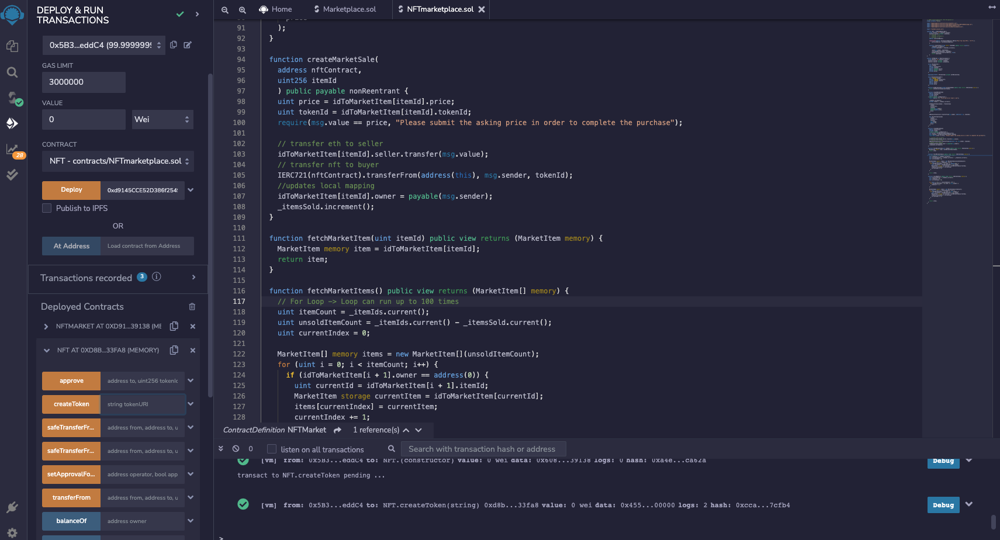
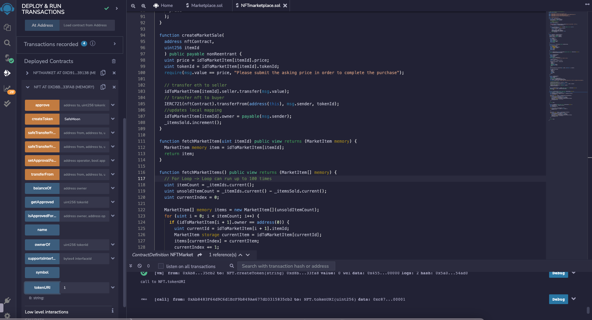
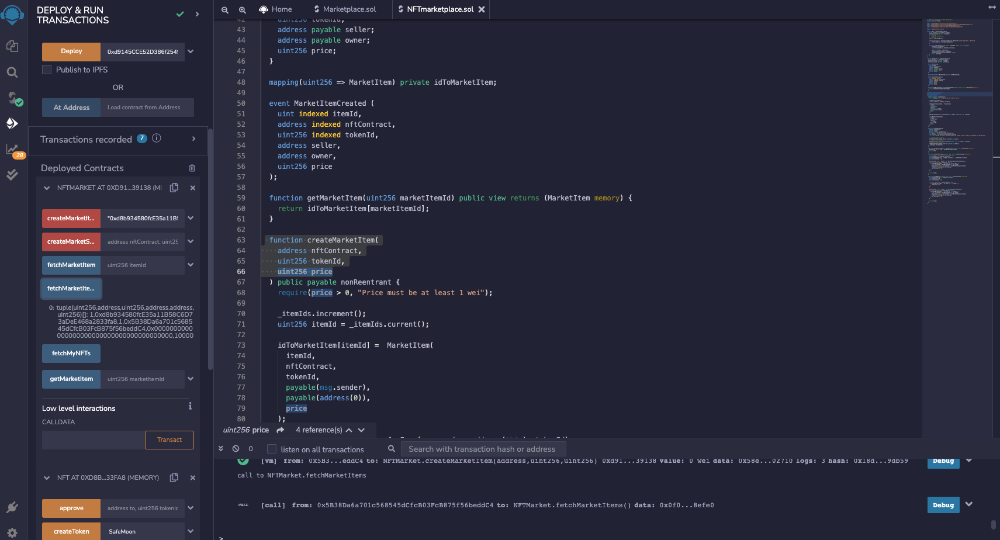

# Project 3 NFT Market Place

### This project aims to develop a marketplace on Ethereum selling and buying NFT's through smart contract developed through solidity.

---

## Technologies

This project leverages Solidity and the web version of the Remix IDE to build and test the smart contracts, Hardhat for editing, compiling, debugging and deploying your smart contracts and dApps, Node.Js for easily building fast and scalable network applications, and Open Zepplein for their library of secure smart contract development.

- [Remix IDE](https://remix.ethereum.org/#optimize=false&runs=200&evmVersion=null&version=soljson-v0.8.7+commit.e28d00a7.js) - is an open source application for developing, deploying, and administering smart contracts that run in Ethereum-based blockchains. We can use this IDE for the entire development cycle of smart contracts and as a playground for teaching and learning Ethereum. The Remix IDE is available in both web and desktop versions.

- [Hardhat](https://hardhat.org/tutorial/setting-up-the-environment) - Hardhat is an Ethereum development environment for professionals. It facilitates performing frequent tasks, such as running tests, automatically checking code for mistakes or interacting with a smart contract. 

- [Node.Js](https://hardhat.org/tutorial/setting-up-the-environment) - Node.js is an extremely powerful JavaScript-based platform used to develop online chat applications, video streaming sites, single-page applications, and many other I/O-intensive web applications and web apps.

- [Open Zeppelin](https://docs.openzeppelin.com/contracts/2.x/api/token/erc721#IERC721) - A library for secure smart contract development. Built on a solid foundation of community-vetted code. Implementations of standards like ERC20 and ERC721.  Flexible role-based permissioning scheme. Reusable Solidity components to build custom contracts and complex decentralized systems.

---

## Deployed Smart Contract

After compiling and deploying the contract, it is important to test its functionality. Below are screenshots to verify the executions.

1. `DeployContract` Contract compiled and Deployed
   

2. Create Token: Created Token named SafeMoon
   

3. Transaction Sale: Sale 1 NFT
   

4. Transaction Buy: Bought 1 NFT
   

There also screen recordings of the smart contract compiling, deploying smart contract then creating token.  Also the sale and purchase of NFT's.